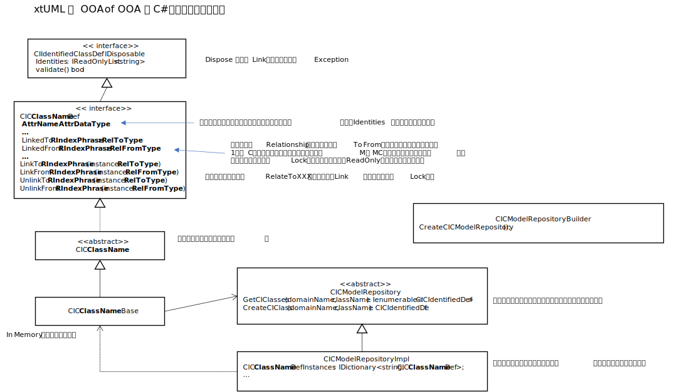
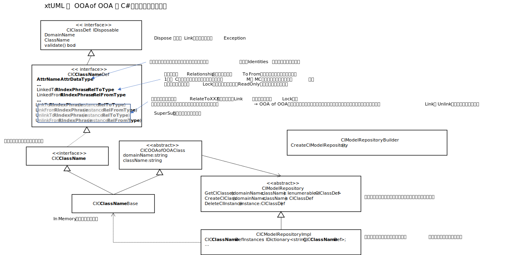

# xtUML の OOA of OOA モデルを C# ライブラリ化する  
[BridgePoint](https://github.com/xtuml/bridgepoint) のモデルコンパイラ向けに定義されている、OOA of OOA モデル（[Art of Conceptual Modeling](https://note.com/kae_made/m/m054c9f9f8b61)で解説している<b>概念情報モデルの概念情報モデル</b>と同等）を、C# アプリケーションで利用可能にするための、クラスライブラリを作成して、公開する。  
イメージとしては、[DTDL(Digital Twin Definition Language) Parser](https://docs.microsoft.com/en-us/azure/iot-develop/concepts-model-parser) の、Microsoft.Azure.DigitalTwins.Parser 名前空間で提供されいる一連の DT<i>Entity</i>Info という名前を持つクラス群の様なもの。  
当初、大枠の変換ルールを決めて、手動で、クラスを定義しようと思ったが、元になる、xtumlmc_schema.sql をざっと眺めて、4000行近くあり量が多いので、これは、[Essense of Software Design](https://note.com/kae_made/m/m2e74d05de8b0) や [Practices of Software Engineering](https://note.com/kae_made/n/n624e6da0f930) で紹介している、ソフトウェア開発成果物自動生成の格好のサンプルだな、ということで、Translator を作って、クラス定義を自動化する事にした。  
そうなると、xtumlmc_schema.sql を、字句解析、構文解析する仕組みが必要になる。  
このファイルをざっと眺めると、大きく分けて、  

- SQL 文法標準の TABLE 定義
- SQL 文法の拡張と思われる Relationship の定義

が見受けられる。どちらも一行完結の比較的シンプルな文法なので、正規表現等を駆使して、最悪、一から自作しても構わないレベルなのだが、SQL 文法標準であれば、既存の SQL Parser を探して使えばいいし、Bridgepoint のソースコードのどこかにありそうなので、それを探して使えばいい…とも思ったが、ここは、自分の字句解析、構文解析の最新技術の習得による自動変換系のスキルアップを兼ねて、最新の最もよく使われていると思われるオープンソースを使って Parser を作ることにした。  
当初、[Roslyn](https://docs.microsoft.com/ja-jp/dotnet/csharp/roslyn-sdk/) ？ と思ったが、これは C# 専用のパーサーなので（確かベースはマルチ言語だったような気が…）、あれこれ探して、Unix 系ではど定番、かつ、古来より伝わる、lex、yacc を、C# と組み合わせて使える、[YaccLexTools](https://www.nuget.org/packages/YaccLexTools/)
 を見つけたので、そういえば四半世紀前によく使ってたな…等と思いながら選定。  
 しかし、ドキュメントほぼなし、サンプル希少につき、使い方が当初判らず難航。  
 一日強、あーだこーだやって、漸く使い方のコツをつかみ、スキーマ定義ファイルをパースして、C# プログラム上で扱えるように用意したデータ構造に全てを格納するところまでを完成(@2022/5/14)し、一旦公開。
 → [Kae.XTUML.Tools.MetaModelGenerator](Kae.XTUML.Tools.MetaModelGenerator/)  
※ [./Solution.sln](./Solution.sln) を Visual Studio で開きビルドする。  
※ xtumlmc_schema.sql のフルパスを第一引数として起動する。  

ちなみに、LexYaccTools を使う肝は、「Lex 側でパターンにマッチした字句に対して、対応する Token の要素をリターンするコードを書くこと」これをやらないと、Yacc 側の構文木定義で字句として使えない。  

Parseser が出来上がって、xtumlmc_schema.sql をパースしたところ  

- Table (概念クラス) 382
- Relationship  508 (うち、2項:437、Super・Sub:45、RelationshipClass付き:26)

が定義されている事が判明。
その後、それぞれの概念クラス、Relationship を C#クラス化するためのフレームワークライブラリを、「BridgePoint の OOA of OOA ならこんな感じだよねぇ…」といった既知の事項を元に検討しつつ、ざっくり定義。大体0.5日。

こんな感じで先ず定義。  
その後、xtumlmc_schema.sql の一部を使ってプロトタイピングを実施し、各 TABLE、Relationshipの定義を具象クラスに変換するルールを試行錯誤しながら決めていく。  

※ この作業は自動化するしないに関わらず必要。約１日を要した。

自動生成するので、生成ルールの作成を開始。先ず、CIC<i>ClassName</i> に当たるインターフェイス（結果的に382のインターフェイスを宣言しなければならないわけだ）の変換ルールを作成。結果的に生成されたファイルは、[CIClassDefs.cs](./Kae.CIM.MetaModel.CIMofCIM/CIClassDefs.cs) なのだが、変換ルールを作成するのと並行して、自動生成に必要なロジックも併せて開発。作成で約0.5日。やってみて分かったことを元に、フレームワークライブラリの修正をしつつ変換ルールのテストを実施。この作業が大体0.5日。  
次に、CIC<i>ClassName</i>Base の変換ルールを作成しつつ、フレームワークライブラリの修正もしつつ（コードへの変換を楽になるようにとか）作業を進めた。結果的に生成されたファイルは、[CIClassBase.cs](Kae.CIM.MetaModel.CIMofCIM/CIClassBases.cs)。作成に約0.5日。

これもファイナルではないのだが、（後は、実際には作ってもあまりメリットはないので本当の開発作業なら作らないが）修正した後のフレームワークライブラリを参考までに図示する。  

  

実装クラスを生成してみて改めて判った修正点を CIClassDefs.cs の変換ルールも見直し・修正しつつ、生成テストを実施。具体的には生成したコードがコンパイルエラーを出さない事が目安。この作業が大体約0.5日。  

ここまでで、自動生成の為に費やした開発日数は、計約3日。  
参考までに、自動生成せずに手作業でのんびりと作業を進めた場合にかかる時間と自動生成を取り入れた作業時間の違いを比較しておく。  
一つの TABLE 定義から2つの C# クラスが作成され、まぁ大体5分位一つの TABLE 定義への対応がかかるとし、一つの Relationship は、二項かスーパーサブか RelationshipClass かで諸々実装ルールが変わるもののざっくり一つあたり5分（実際には10分以上かかるものもありそうだが）と、係る時間は、  
382 × 5 分 + 508 × 5 分 = 4450 分 ≒ 74時間 ≒ 12 日  
※1日当たりの実働を6時間とする。上に挙げた日数の単位と同じ。
と見積もられ、9日間の短縮となっている。この段階で、手作業に比べて、4倍の効率となっている。今後、作業が進むにしたがってさらなる見直しが発生することは火を見るより明らかなので、自動生成は、どんどん効率化の度合いが大きくなっていくことが判る。  

この時点で、2022/5/18 の日暮れ。残りは、CIModelRepsitory クラスの実装の部分と、BridgePoint で作成したモデルを作成したライブラリに入れ込む部分の開発。